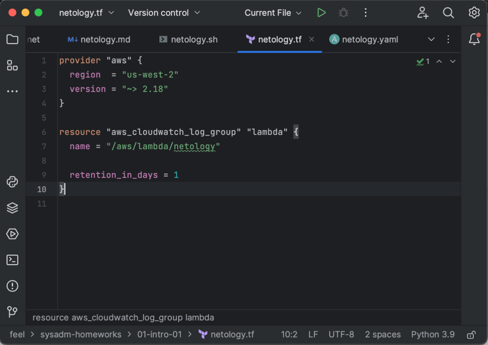
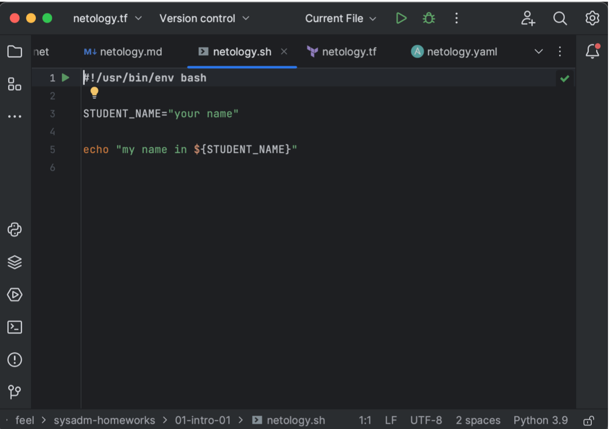
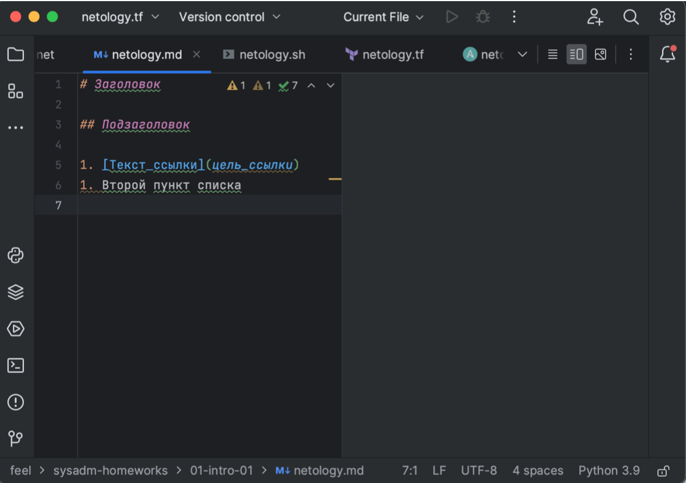
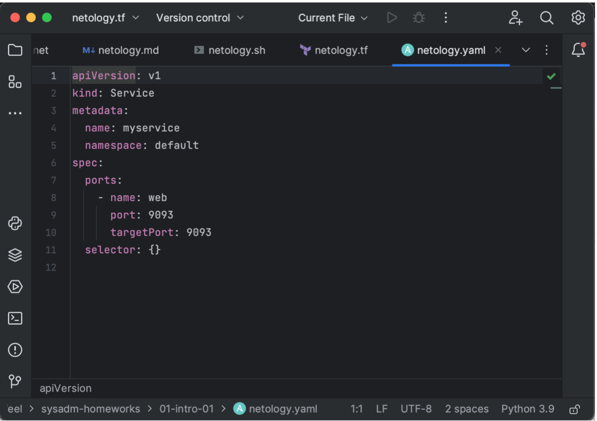
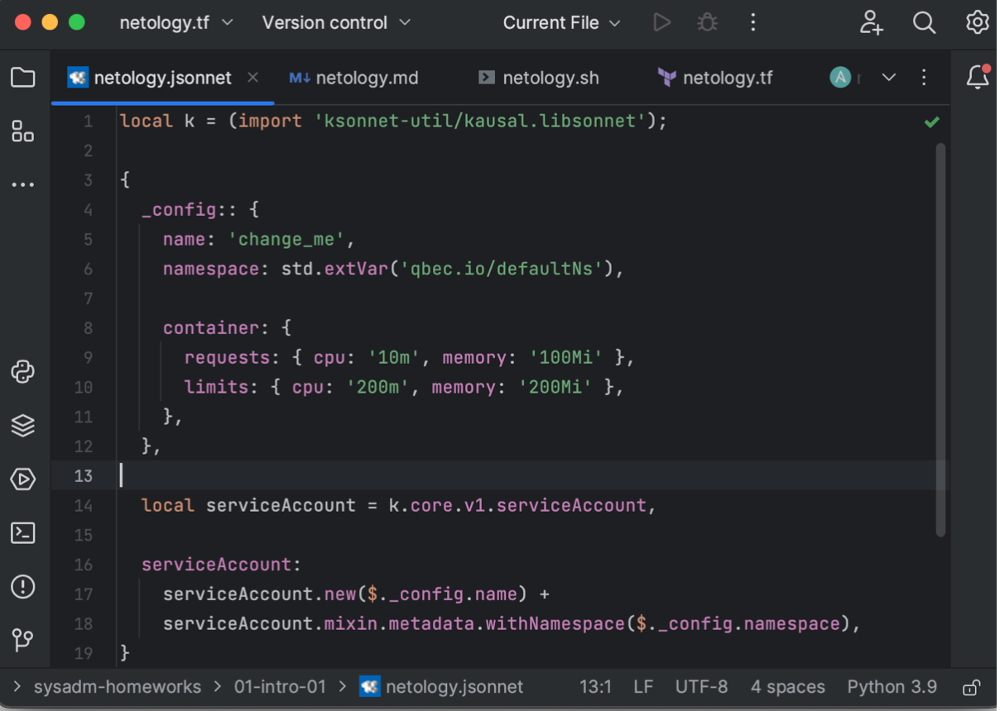

#  Домашнее задание к Занятию «1.1. Введение в DevOps»

## Задание 1. Подготовка рабочей среды
Вы пришли на новое место работы или приобрели новый компьютер. Сначала надо настроить окружение для дальнейшей работы.

### Решение 1. Подготовка рабочей среды
- Terraform 
- Bash 
- Markdown 
- YAML 
- Jsonnet 

## Задание 2. Описание жизненного цикла задачи (разработки нового функционала)
Чтобы лучше понимать предназначение инструментов, с которыми вам предстоит работать, составим схему жизненного цикла задачи в идеальном для вас случае.
Описание истории
Представьте, что вы работаете в стартапе, который запустил интернет-магазин. Он достаточно успешно развивался, и пришло время налаживать процессы: у вас стало больше конечных клиентов, менеджеров и разработчиков.
Сейчас от клиентов вам приходят задачи, связанные с разработкой нового функционала. Задач много, и все они требуют выкладки на тестовые среды, одобрения тестировщика, проверки менеджером перед показом клиенту. В некоторых случаях вам будет необходим откат изменений.

### Решение 2. Описание жизненного цикла задачи (разработки нового функционала)

1. PM собирает задачи и цели у клиента и ставит задачу на проектирование команде программистов. 
2. После проектирования команда программистов приступает к разработке.
3. Программисты пишут код и отправляют его на сборку.
4. Тестировщики в результате теста сборок регистрируют ошибки и отправляют программистам на доработку.
5. Успешные сборки тестировщик разрешает пустить в релиз и задача попадает DevOps.
6. DevOps производит деплой релиза.
7. PM производит проверку перед показом клиенту. PM может сам отправить на доработку, либо по результатам показа клиентам так же может возникнуть необходимость в правках.
