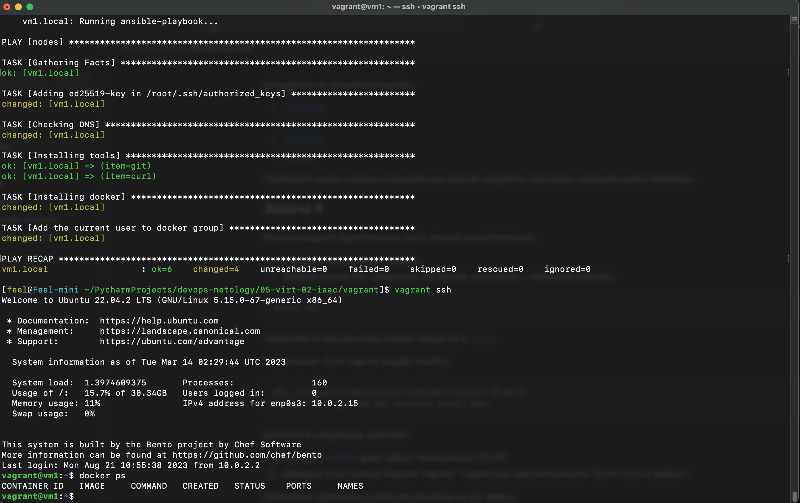

# Домашнее задание к занятию "2. Применение принципов IaaC в работе с виртуальными машинами"

## Задание 1
- Опишите основные преимущества применения на практике IaaC-паттернов.
- Какой из принципов IaaC является основополагающим?
### Решение
- Увеличение скорости развертывания инфраструктуры и снижение трудозатрат на ручное конфигурирование.
- При отлаженном паттерне исключаются ошибки, которые могли бы быть допущены при ручном конфигурировании.
- Версионность паттернов. Если хранить их в системе контроля версий, можно увидеть кто вносил изменения.
## Задание 2
- Чем Ansible выгодно отличается от других систем управление конфигурациями?
- Какой, на ваш взгляд, метод работы систем конфигурации более надёжный push или pull?
### Решение
- Ansible отличает то, что он не требует установки агентов, а использует существующее SSH подключение.
- Pull, т.к отсутствует единая точка отказа.
## Задание 3
Установите на личный компьютер:
- VirtualBox,
- Vagrant,
- Terraform,
- Ansible.\
Приложите вывод команд установленных версий каждой из программ, оформленный в Markdown.
### Решение
- [feel@Feel-mini ~]$ VBoxManage --version\
7.0.10r158379

- [feel@Feel-mini ~]$ terraform --version\
Terraform v1.5.5\
on darwin_amd64

- [feel@Feel-mini ~]$ ansible --version \
ansible [core 2.15.3]
  config file = None
  configured module search path = ['/Users/feel/.ansible/plugins/modules', '/usr/share/ansible/plugins/modules']
  ansible python module location = /usr/local/Cellar/ansible/8.3.0/libexec/lib/python3.11/site-packages/ansible
  ansible collection location = /Users/feel/.ansible/collections:/usr/share/ansible/collections
  executable location = /usr/local/bin/ansible
  python version = 3.11.4 (main, Jun 20 2023, 16:51:49) [Clang 14.0.0 (clang-1400.0.29.202)] (/usr/local/Cellar/ansible/8.3.0/libexec/bin/python)
  jinja version = 3.1.2
  libyaml = True

- [feel@Feel-mini ~]$ vagrant --version \
Vagrant 2.3.7

## Задание 4

