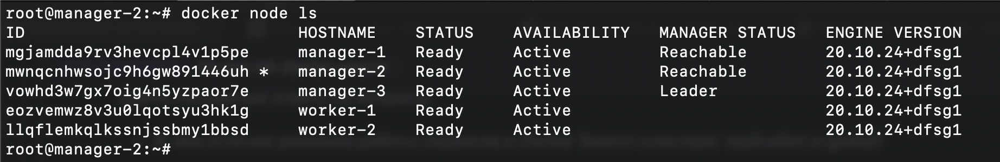

# Домашнее задание к занятию "5. Оркестрация кластером Docker контейнеров на примере Docker Swarm"

## Задание 1
### Решение
- Replicated-режим создает заданное количество контейнеров на всех доступных нодах. Global-режим создает сервис в одном экземпляре на всех доступных нодах.
- Используется алгоритм Raft. Менеджеры в кластере обмениваются между собой информацией, при выходе из строя одного менеджера происходит голосование на выбор нового менеджера.
- Overlay-сеть - это сеть, которая объединяет докер-контейнеры с разных физических машин в одну подсеть. Использует vxlan для построения тунеля. Так же overlay-сеть создает ingress для связи с внешним миром и балансировки нагрузки.

## Задание 2
### Решение

## Задание 3
### Решение
