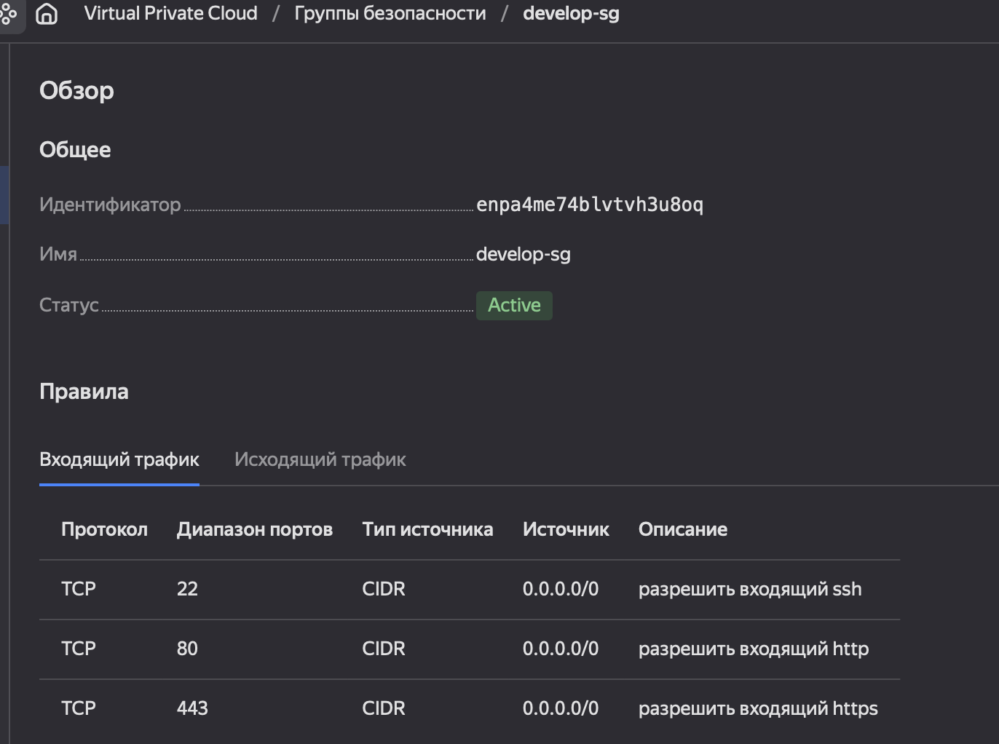
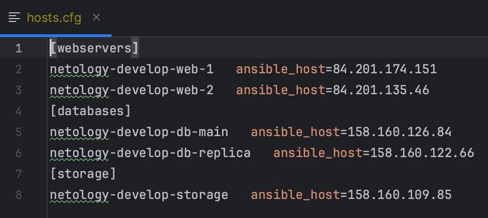

# Домашнее задание к занятию "6.3. Управляющие конструкции в коде Terraform"

## Задание 1
### Решение

## Задание 2
### Решение
Задание выполнено

## Задание 3
### Решение
Задание выполнено

## Задание 4
### Решение
