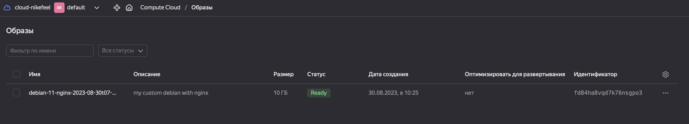
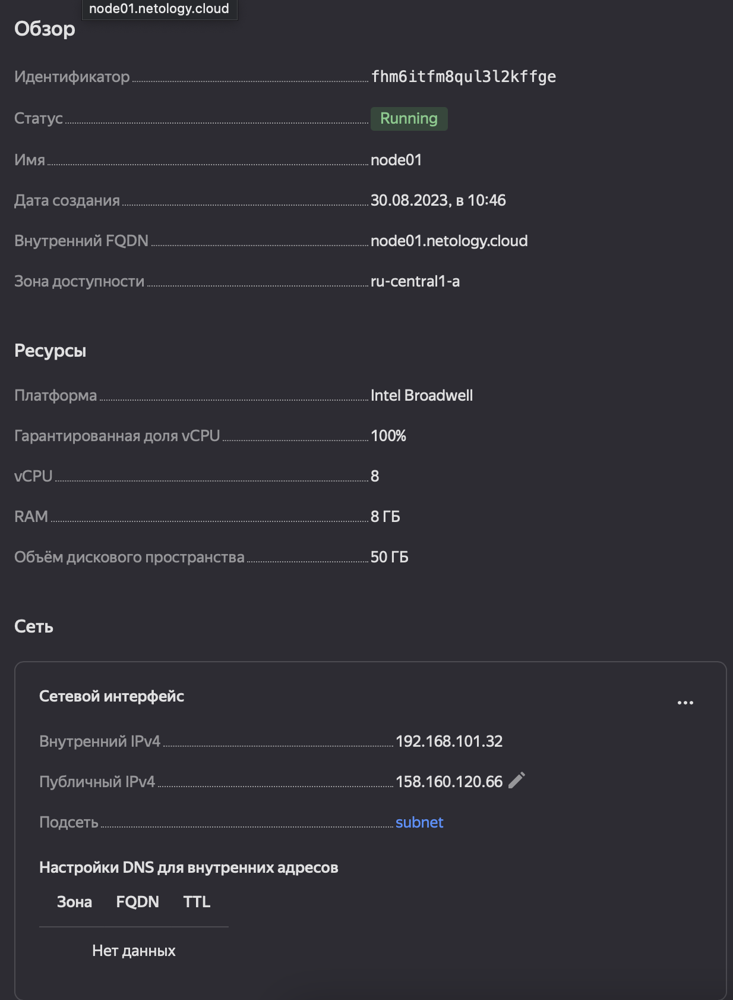
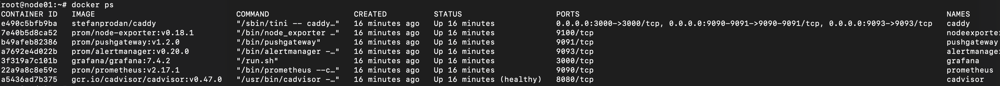
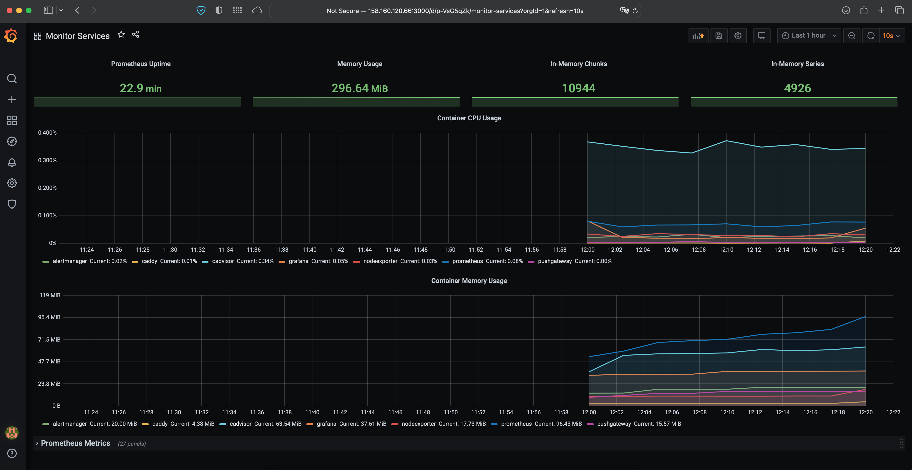

# Домашнее задание к занятию "5.4. Оркестрация группой Docker-контейнеров на примере Docker Compose"

## Задание 1
### Решение

## Задание 2
### Решение
[Terraform log](terraform.md)

## Задание 3
### Решение

## Задание 4
### Решение

