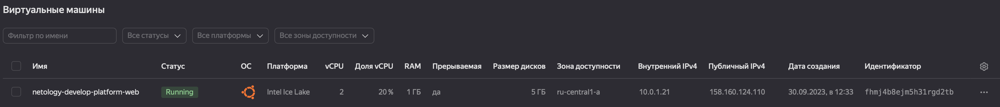
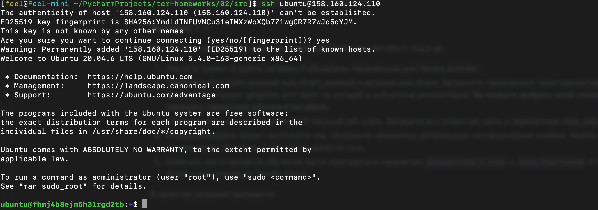
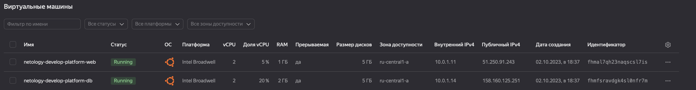

# Домашнее задание к занятию "6.2. Основы Terraform. Yandex Cloud"

## Задание 1
### Решение

```Error: Error while requesting API to create instance: server-request-id = 64a9551d-adeb-4020-b2e2-02c386b07c4c server-trace-id = a3a6f107ed5193f:868767b49fd53c67:a3a6f107ed5193f:1 client-request-id = ac0b4827-9e06-4731-9e56-f14c9d9cfdc7 client-trace-id = 9ca767e9-74b3-4a42-bddc-f68ffad12170 rpc error: code = FailedPrecondition desc = Platform "standart-v4" not found```

Ошибка в слове standart и платформы v4 нет в YC. используем standard-v1

```Error: Error while requesting API to create instance: server-request-id = 86b3814d-1569-4c88-ac09-557bfdf0a14f server-trace-id = 5613ad4ae95a448e:a95b6546b78e8e16:5613ad4ae95a448e:1 client-request-id = 96d51ccf-2973-4694-b1fa-e601438308d9 client-trace-id = d6c4f90c-5e31-4c8a-92f1-d0517048d8ea rpc error: code = InvalidArgument desc = the specified number of cores is not available on platform "standard-v1"; allowed core number: 2, 4```

Количество ядер должно быть 2 или 4.





`preemptible = true`

`core_fraction=5`

В рамках обучения это может пригодится для экономии ресурсов и средств.
Прерываемые виртуальные машины доступны по более низкой цене в сравнении с обычными, однако не обеспечивают отказоустойчивости.

## Задание 2
### Решение
Задание выполнено успешно.

## Задание 3
### Решение


## Задание 4
### Решение
```
$ terraform output 
external_ip = {
  "netology-develop-platform-db" = "158.160.125.251"
  "netology-develop-platform-web" = "51.250.91.243"
}
```
## Задание 5
### Решение
Задание выполнено успешно.

## Задание 6
### Решение
Задание выполнено успешно.