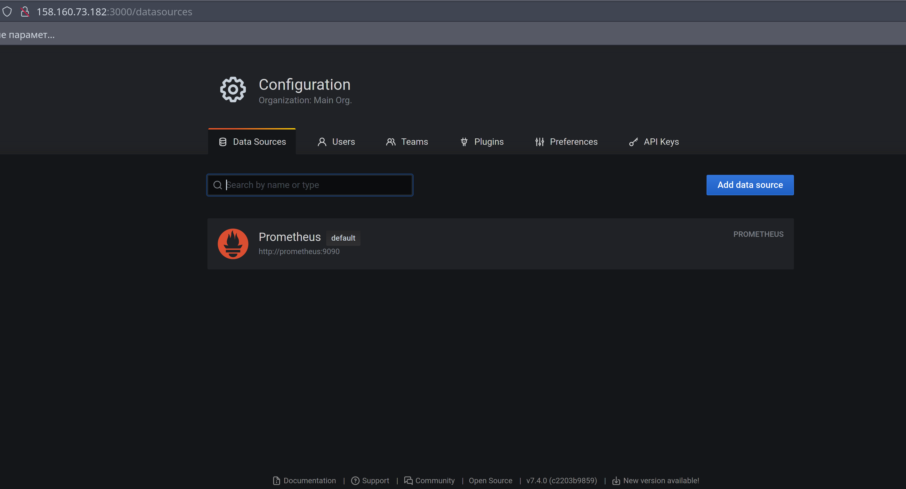
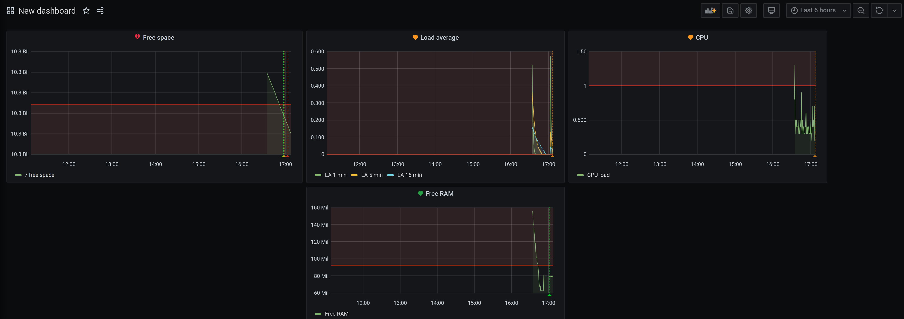
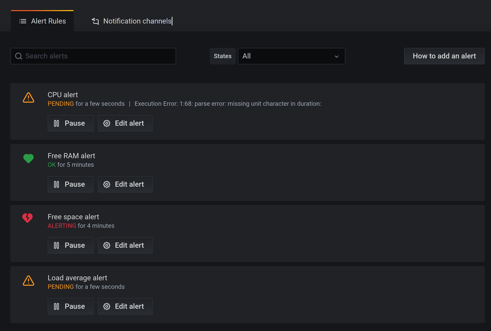

# Домашнее задание к занятию "3. Grafana"

## Решение
### Задание 1


### Задание 2



Для запроса свободного места

``` sum by(mountpoint) (node_filesystem_avail_bytes{mountpoint=~"/"}) ```

Для запроса Load Average

``` node_load1{instance="nodeexporter:9100"} ```
``` node_load5{instance="nodeexporter:9100"} ```
``` node_load15{instance="nodeexporter:9100"} ```

Для запроса CPU load

``` 100 - (avg by(instance) (irate(node_cpu_seconds_total{mode="idle"}[$__rate_interval])) * 100) ```

Для запроса свободной RAM

``` node_memory_MemFree_bytes{instance="nodeexporter:9100"}```

### Задание 3
Dashboard с настроенными алертами


Сработавшие алерты


JSON
[file](grafana.json)