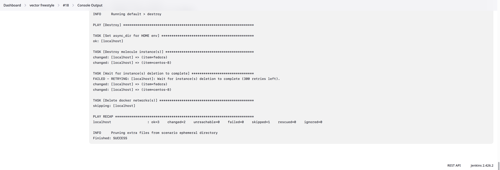

# Домашнее задание к занятию 4 «Jenkins»

## Решение

Была настроена одна нода для проведения тестирования. 

Установлена последняя версия `molecule 6.0.3` и `molecule-plugins[docker]`.

### Запущен FreeStyle Job с тестом роли

### Запущен Declarative Pipeline Job с тестом роли

### Запущен Multibranch Pipeline Job с Jenkinsfile с тестом роли

### Запущен Scripted Pipeline Job

