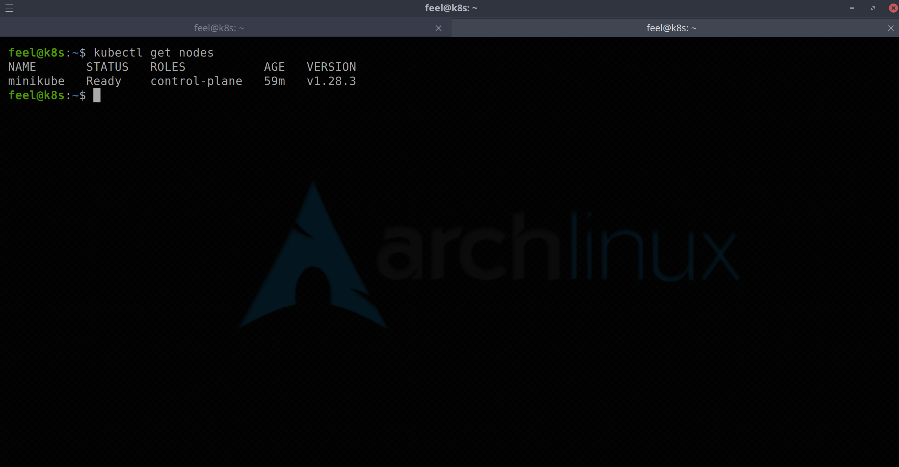
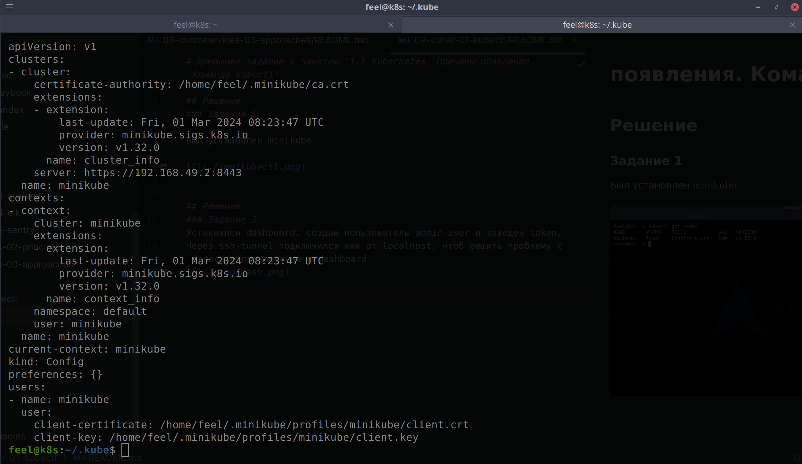
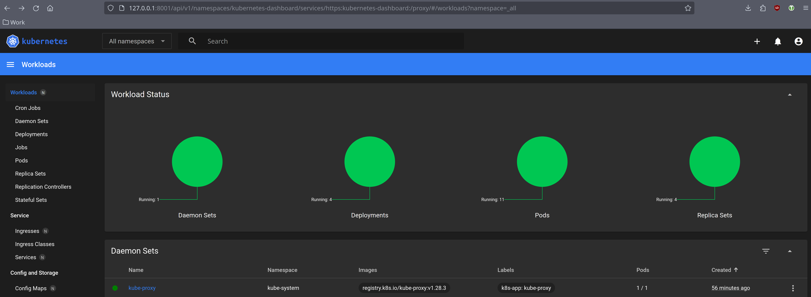

# Домашнее задание к занятию "1.1 Kubernetes. Причины появления. Команда kubectl"

## Решение
### Задание 1

Был установлен minikube

## Решение
### Задание 2
Установлен dashboard, создан пользователь admin-user и заведен token. 
Через ssh-tunnel подключился как от localhost, чтоб решить проблему с insecure подключение к dashboard.

