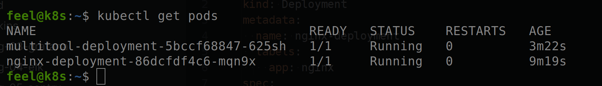
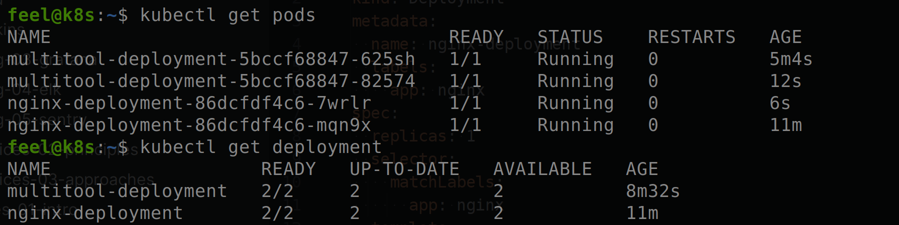
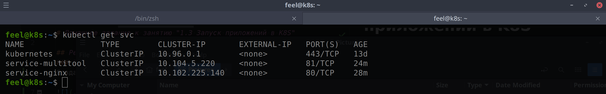
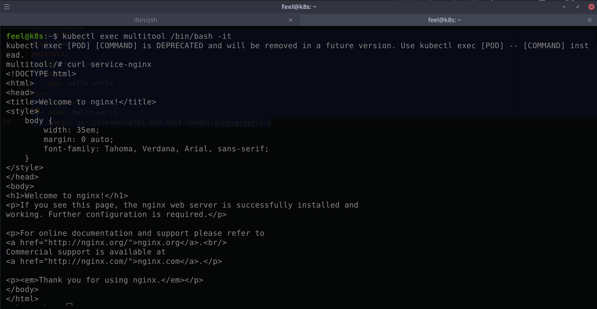
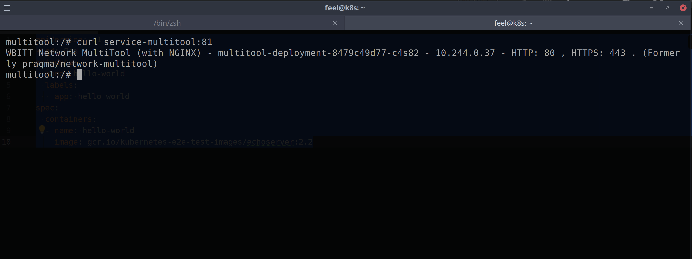
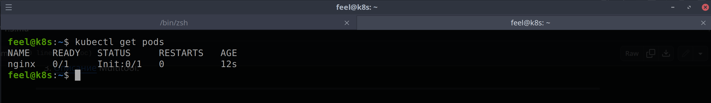
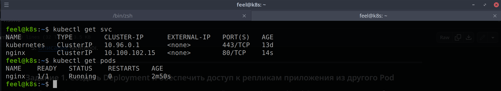

# Домашнее задание к занятию "1.3 Запуск приложений в K8S"

## Решение
### Задание 1
Создан deployment двух контейнеров в поде

Увеличено количество реплик

Созданы сервисы

Соединение из отдельного пода multitool

Манифесты\
[nginx](nginx.yaml)\
[multitool](multitool.yaml)\
[multitool-pod](multitool-pod.yaml)\
[service-nginx](svc-nginx.yaml)\
[service-multitool](svc-multitool.yaml)

## Решение
### Задание 2

Манифесты\
[nginx](nginx-pod.yaml)