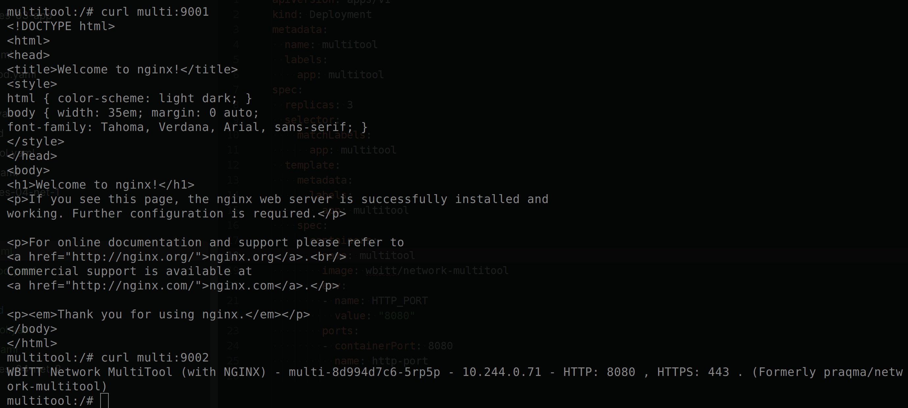

# Домашнее задание к занятию "1.4 Сетевое взаимодействие в Kubernetes. Часть 1"

## Решение
### Задание 1

Манифесты\
[dep-multi](dep-multi.yaml)\
[service-multi](svc-multi.yaml)

## Решение
### Задание 2

[service-multi-node](svc-multi-node.yaml)